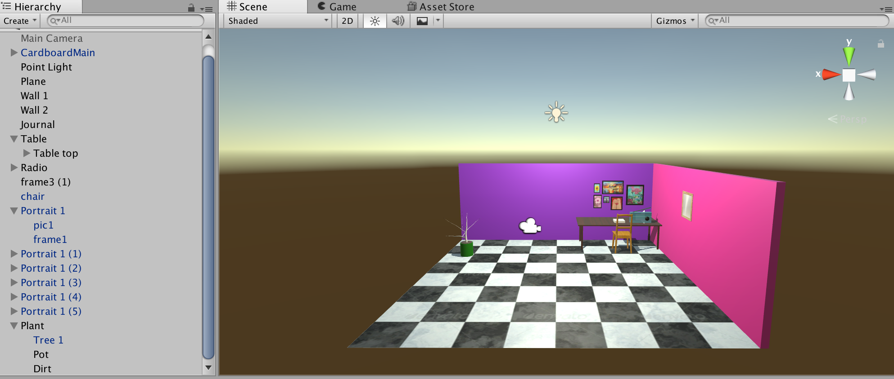
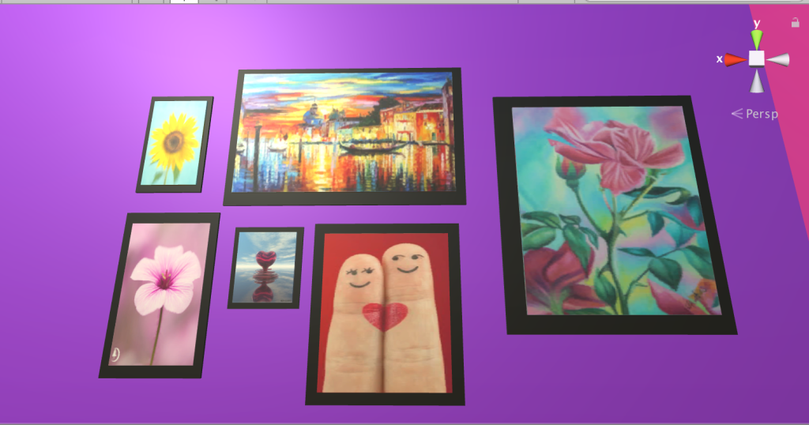

# The Assignment:
The development of a VR world which takes advantage of the malleability of the digital medium to showcase a strong identity (peaceful, stressful, grandiose, empty, etc.) , and (2) the implementation of at least one interaction with the world (changing/removing/ adding elements).

## What I did:
As a fan of solace, I decided to make a VR world which took advantage of colours and space to create that. I think people associate solace with morbidity many times, but I wanted to create a project that was solace in a positive light, which I enjoy. I decided to use positive colors, pictures and music to create this positive vibe.

## Assets Used:
__Point light__ – I used a point light instead of a directional light to make it seem like an illuminated room
__The plane(floor)__ – I used a black and white checkered tile material on the floor.
__Wall 1, Wall 2__ – These are pink and purple, and change colour when the user interacts with the environment.
__Journal__ – A part of the solace is having this book on the table to write on. I would ideally want to have the user interact with this as well.
__Table__ – This is an asset I created using 5 cubes, one for the top, and the legs as children.
__Radio__ – I also created the radio with cubes and a sphere for the knob.
__frame3(1)__ – The mirror on the pink side of the wall
__Portraits__ – These portraits lying above the table were created using two cubes each, one for the frame and one for the picture itself, which I added by using pictures I thought would create that positive feeling as materials. I was thinking of having them float off the wall and rotate while the music plays.

__Plant__ – I would ideally want the user to be able to interact with the plant too.It could grow whenever he/she looks at it.

## Why did you make that project?
I made this project because it is a perfect representation of what I love. I would be excited to interact with such an environment (with much more detailed interactions, maybe).

## What is the intent behind the environment?
My intent was to help the users to induce a more positive mood.

## What is the intent behind your interaction?
The interaction happens ones the user presses the trigger. It plays a song called “Scars to Your Beautiful” by Alessia Cara, which is a song about self-empowerment and acceptance. The radio moves up and down while this is playing. The walls also change color. When the trigger is pressed again, everything goes back to normal. I would like to add more songs to the environment that different interactions might be able to play. I also discovered the particle system and would like to play around with the idea of using it as sound waves for the music.
I have so many ideas but had little time to implement them and it was really hard to figure out the coding system. What put me behind even more is that I wasn’t using the Carboard SDK but the Gvr SDK (not sure of the difference but nothing was working until I figured this out at the last minute.) However, I plan to keep working on this project indefinitely.